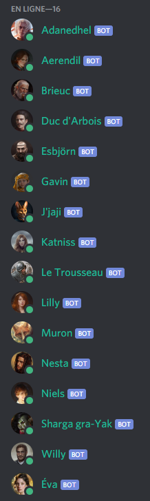
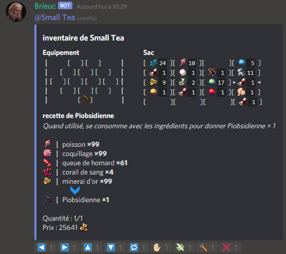
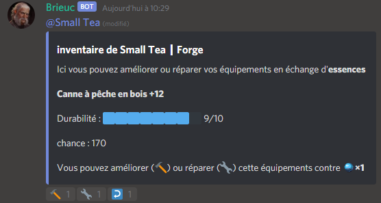
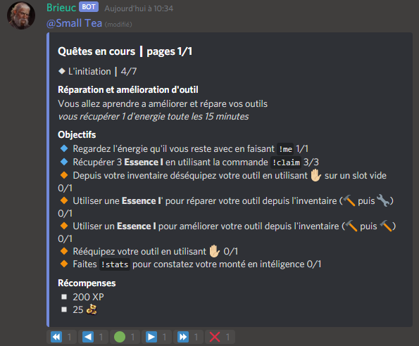
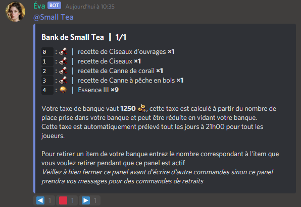
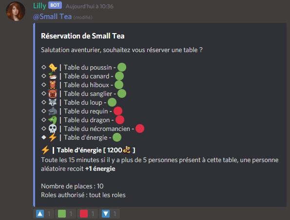
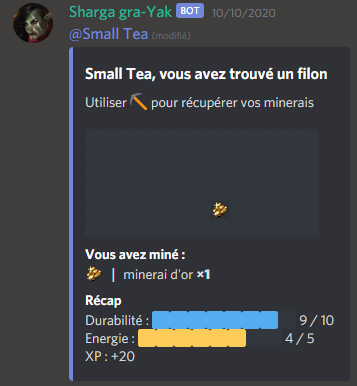

# PublicMuron

PublicMuron is a clone of my private projet **Muron**, the project being abandonned i decide to share the code.
This project is the first as i know to allow multiple bot sharing their api call to avoid discord rates limits.
In the current version, 16 bots share every api call that can be shared (everything except message editing).

If you want to host your own version, be prepared to spend a lot of time there and follow every step of __Before installation__ and __Installation__ sections.

If you only want to see the bots running, you can visit [Brumetière](https://discord.gg/ErCP6Xn7up), this is the abandonned community server with the bots still running on it.

## Features

- Auto updating panels for interacting with the user
- Joining gate that force users to read rules
- XP and level throught vocal and chat activity
- Quest system easly scalable in code
- Hidden success
- Interactive inventory
- Bank to stock more items
- Rank system with adaptative prices and daily taxs
- Capacity to equip tools and farm while being active in voice channels
- Tools crafting and upgrading
- Prison for moderation and punishment

## Before installation

- Create 16 discord bots
- Create your main server based on the [template](https://discord.new/wUN5t5XMGQ6g)
- Create 3 server and add emoji to them for every emoji name inside ``emoji_list.txt``
- Add the ids of the 3 emoji's servers to config.json
- Add your 16 bots to your main server and the 3 emoji's servers
- Add the PNJ roles to every bots in the main server
- Fill the config_server.json

## Installation

You should run the program using [Docker](https://www.docker.com/).

First create the local network for communication between bot and database.
```bash
docker network create --subnet=172.18.0.0/16 muron_network
```

Then create the [mongodb](https://hub.docker.com/_/mongo) database.
```bash
docker pull mongo
run --net muron_network --ip 172.18.0.2 -d --name muron_mongo mongo:latest
```

Finaly use the repo's Dockerfile to create the muron container and run it.
```bash
cd PublicMuron
docker build -t muron .
docker run --net muron_network --ip 172.18.0.3 --name muron_server -d muron
```

## Usage

If you see the all the bots turning on without any error after starting the container, you did everything correct, otherwise check the errors and try to fix them.
You can always contact me throught the [Brumetière](https://discord.gg/ErCP6Xn7up) server or add me on discord for any questions ``Small Tea#1357``

## Notes

- All the narration is stored inside narration.json so you can change every text the bot displayed without touching the code
- You can install mongodb localy and all the requirements from ``requirements.txt`` to run the bot localy for testing, i recomand using python [Python 3.7.6](https://www.python.org/downloads/release/python-376/) in that case

## Screenshots






